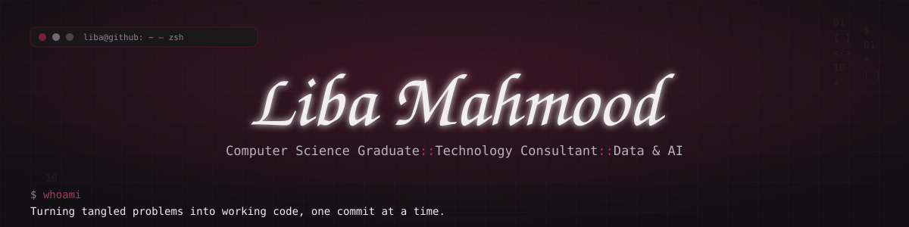

<div align="center">



<a href="https://liba4m.github.io/my-portfolio/">
  
</a>

[](https://liba4m.github.io/my-portfolio/)
[](https://www.linkedin.com/in/liba-mahmood)
[](https://tutorgenie.vercel.app/)

</div>

```bash
$ whoami
> Liba Mahmood — BSc Computer Science Graduate

$ cat interests.txt
> Technology Consulting · Data Analytics · AI Engineering · Cybersecurity

$ cat mission.txt
> Turning complex information into clear insight, and ideas into real-world solutions.
```

### // 01. Key Skills

<div align="center">


</div>

### // 02. Projects

#### 🧞 [TutorGenie](https://tutorgenie.vercel.app/)


AI-powered tutor support platform that helps tutors generate personalised lesson plans, targeted feedback, and organise student learning more efficiently.

- **Built:** the full stack end-to-end — database schema, authentication, AI-powered lesson/feedback generation via Azure OpenAI, and a responsive Next.js/Tailwind UI.
- **Learned:** how to design a real product around an actual workflow problem, prompt-engineer AI output into something genuinely usable, and structure a scalable full-stack app from database to deployment.

**[→ View Live](https://tutorgenie.vercel.app/)**

#### 🌍 [Global CO₂ Emissions Analysis](https://github.com/Liba4M/co2-emissions-visualisation)


Exploration of the Our World in Data CO₂ dataset, visualising long-term emission trends, top emitters by total and per-capita output, the GDP–emissions relationship, and breakdowns by fuel type.

- **Built:** data cleaning/wrangling pipelines and a set of visualisations uncovering global emissions disparities and trends over time.
- **Learned:** exploratory data analysis end-to-end — from messy raw data to a clear, visual narrative — and how to reason about sustainability questions using real datasets.

**[→ View Source](https://github.com/Liba4M/co2-emissions-visualisation)**

### // 03. GitHub Stats

<div align="center">


</div>

### // 04. Contact

<div align="center">

[](mailto:liba.mahmood@icloud.com)
[](https://www.linkedin.com/in/liba-mahmood)
[](https://liba4m.github.io/my-portfolio/)

</div>

<div align="center">

<sub>> thanks for stopping by_</sub>

</div>
